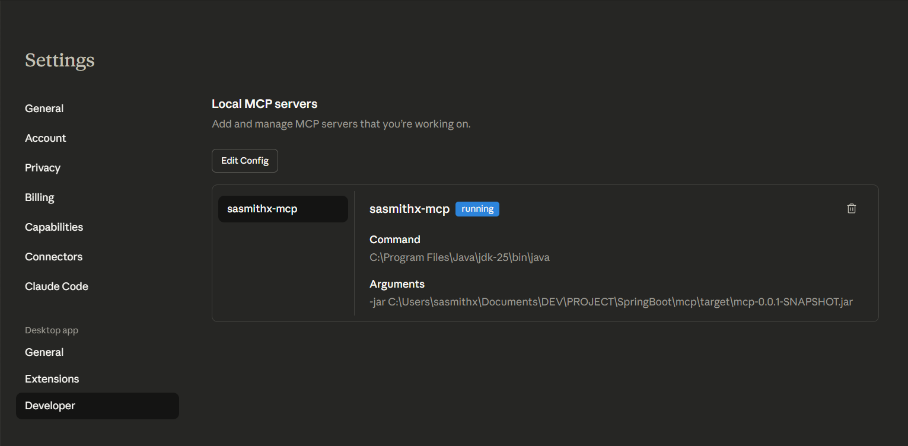
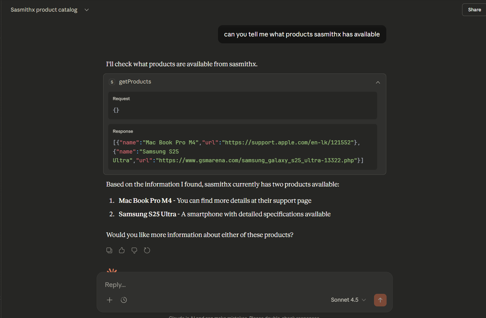

# MCP Server

A Spring Boot-based Model Context Protocol (MCP) server implementation providing centralized logging, error handling, and product management capabilities.

## 📋 Table of Contents

- [Overview](#overview)
- [Features](#features)
- [Architecture](#architecture)
- [Prerequisites](#prerequisites)
- [Installation](#installation)
- [Configuration](#configuration)
- [Usage](#usage)
- [API Documentation](#api-documentation)
- [Logging](#logging)
- [Project Structure](#project-structure)
- [Building & Deployment](#building--deployment)
- [Troubleshooting](#troubleshooting)
- [Contributing](#contributing)
- [License](#license)

## 🎯 Overview

The MCP Server is a headless Spring Boot application that implements the Model Context Protocol (MCP) specification. It provides a robust foundation for building MCP-compliant servers with enterprise-grade logging, error handling, and product management features.

**Version:** 0.0.1-SNAPSHOT  
**Server Name:** sasmithx-mcp  
**Application Type:** Headless (No Web UI)

## ✨ Features

- **Model Context Protocol (MCP) Compliance** - Full implementation of MCP server specification
- **Centralized Logging** - File-based logging with rolling policies and retention management
- **Error-Level Filtering** - Structured error logging for production environments
- **Product Management** - Built-in product service for data management
- **Spring AI Integration** - Seamless integration with Spring AI framework
- **Headless Architecture** - Optimized for backend-only operations
- **Maven Build System** - Standard Maven build and dependency management

## 🏗️ Architecture

### System Design



*Figure 1: Local MCP architecture overview showing component interactions*

### Response Pattern



*Figure 2: Standard MCP response pattern and data flow*

## 📦 Prerequisites

- **Java 17+** - JDK 17 or higher
- **Maven 3.8.0+** - Build automation tool
- **Spring Boot 3.x** - Application framework
- **Spring AI** - AI integration framework

## 🚀 Installation

### Clone Repository

```bash
git clone <repository-url>
cd mcp
```

### Verify Prerequisites

```bash
java -version
mvn -version
```

### Build Project

```bash
mvn clean package -DskipTests
```

### Run Application

```bash
java -jar target/mcp-0.0.1-SNAPSHOT.jar
```

## ⚙️ Configuration

### Application Properties

The application is configured via `src/main/resources/application.properties`:

```properties
# Application Metadata
spring.application.name=mcp
spring.main.web-application-type=none
spring.ai.mcp.server.name=sasmithx-mcp
spring.ai.mcp.server.version=0.0.1

# UI Configuration
spring.main.banner-mode=off

# Logging Configuration
logging.pattern.console=
logging.file.name=mcp-server.log
logging.level.root=ERROR
logging.level.org.springframework=ERROR
logging.level.org.springframework.ai=ERROR
logging.level.com.sasmithx=ERROR
```

### Logging Configuration

Advanced logging configuration is defined in `src/main/resources/logback-spring.xml`:

- **Log File:** `mcp-server.log`
- **Rotation Policy:** Daily with 7-day retention
- **Log Level:** ERROR for all components
- **Pattern:** Timestamp | Level | Logger | Message

## 💻 Usage

### Starting the Server

```bash
mvn spring-boot:run
```

### Building for Production

```bash
mvn clean package -DskipTests
```

### Running Tests

```bash
mvn test
```

### Full Build with Tests

```bash
mvn clean package
```

## 📚 API Documentation

### ProductService

Manages product-related operations within the MCP server.

**Key Methods:**
- `getProduct(id)` - Retrieve product by ID
- `getAllProducts()` - List all available products
- `createProduct(product)` - Create new product
- `updateProduct(id, product)` - Update existing product
- `deleteProduct(id)` - Delete product

### Product Model

```java
public class Product {
    private String id;
    private String name;
    private String description;
    private BigDecimal price;
}
```

## 📊 Logging

### Log Location

All application logs are written to: `mcp-server.log`

### Log Levels

- **ERROR** - Production-level errors only
- **WARN** - Not configured (suppressed)
- **INFO** - Not configured (suppressed)
- **DEBUG** - Not configured (suppressed)

### Log Format

```
timestamp | LEVEL | logger.name | message
```

### Example Log Entry

```
2025-12-24 10:15:30.123 | ERROR | com.sasmithx.mcp.ProductService | Product not found: ID-12345
```

## 📁 Project Structure

```
mcp/
├── src/
│   ├── main/
│   │   ├── java/
│   │   │   └── com/sasmithx/mcp/
│   │   │       ├── McpApplication.java       # Main application class
│   │   │       ├── Product.java              # Product entity model
│   │   │       └── ProductService.java       # Product business logic
│   │   └── resources/
│   │       ├── application.properties        # Spring configuration
│   │       ├── logback-spring.xml           # Logging configuration
│   │       └── img/
│   │           ├── local-mcp.png            # Architecture diagram
│   │           └── response.png             # Response flow diagram
│   └── test/
│       └── java/com/sasmithx/mcp/
│           └── McpApplicationTests.java      # Integration tests
├── pom.xml                                   # Maven configuration
├── mvnw                                      # Maven wrapper (Linux/Mac)
├── mvnw.cmd                                  # Maven wrapper (Windows)
└── README.md                                 # This file
```

## 🔨 Building & Deployment

### Local Development Build

```bash
mvn clean install
```

### Package for Deployment

```bash
mvn clean package -DskipTests
```

### Build Output

- **JAR File:** `target/mcp-0.0.1-SNAPSHOT.jar`
- **Original JAR:** `target/mcp-0.0.1-SNAPSHOT.jar.original`
- **Classes:** `target/classes/`

### Docker Deployment (Optional)

```dockerfile
FROM openjdk:17-jdk-slim
COPY target/mcp-0.0.1-SNAPSHOT.jar app.jar
ENTRYPOINT ["java", "-jar", "app.jar"]
```

## 🔧 Troubleshooting

### Issue: Build Fails with Compilation Errors

**Solution:**
```bash
mvn clean compile
mvn -U clean package -DskipTests
```

### Issue: Log File Not Generated

**Solution:**
- Verify `mcp-server.log` path is writable
- Check `logback-spring.xml` configuration
- Ensure logging level is not suppressed

### Issue: Spring AI Dependency Errors

**Solution:**
```bash
mvn clean install -U
mvn dependency:resolve
```

### Issue: Test Failures

**Solution:**
```bash
mvn clean test -X
```

## 🤝 Contributing

### Development Workflow

1. Create a feature branch: `git checkout -b feature/your-feature`
2. Make changes and commit: `git commit -m "feat: description"`
3. Push to remote: `git push origin feature/your-feature`
4. Create Pull Request from `dev` to `main`

### Code Standards

- Follow Spring Framework conventions
- Use meaningful variable and method names
- Add appropriate logging statements
- Write unit tests for new features
- Document complex logic with comments

### Commit Message Format

```
<type>: <subject>

<body>

<footer>
```

**Types:** feat, fix, docs, style, refactor, test, chore

## 📄 License

This project is licensed under the MIT License. See the [LICENSE](LICENSE) file for details.

---

**Last Updated:** December 24, 2025  
**Maintainer:** sasmithx  
**Status:** Active Development


